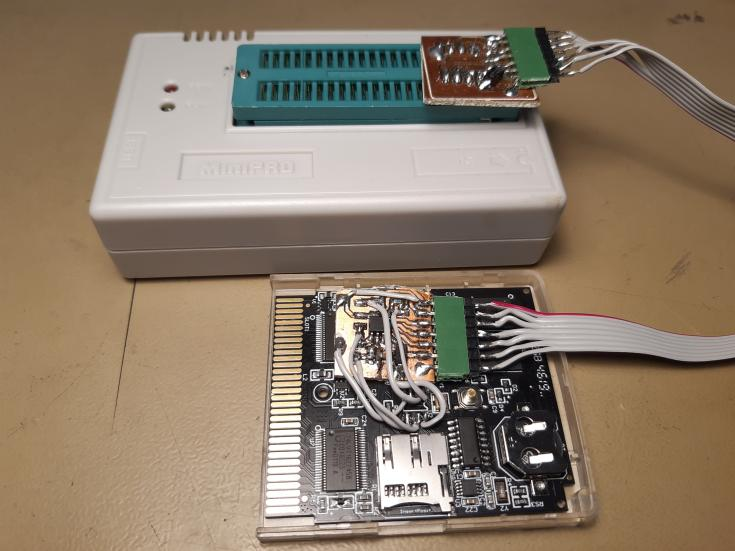

## Electronic parts

Work in progress.

| Part designator | Part marking              | Part type       | Package type | Description |
| --------------- | ------------------------- | --------------- | -------------| ----------- |
| V1              | LDBQJ?                    | ???             | SOT23-5      | Switching voltage regulator with 0.6 V internal reference voltage. Produces 3.3 V in this design. |
| V2              | LDBQJ?                    | ???             | SOT23-5      | Switching voltage regulator with 0.6 V internal reference voltage. Produces 1.2 V in this design. |
| U1              | XC3S200A VQG100AGQ1137 | XC3S200A        | VQFP100      | FPGA Spartan-3A, 4032 cells |
| U2              | FT25H16S                  | FT25H16         | SOIC8        | SPI Flash 16 Mb (2 MB) 2.7-3.6 V |
| U3              | 8563S 1935 TMS      | PCF8563         | TSSOP8       | Real-time clock with I2C interface |
| U4              | 71GL064A08BFW0B           | S71GL064A08     | 56-FBGA      | Parallel flash 64 Mb (8 MB) with pSRAM 8 Mb (1 MB) 2.7-3.3 V |
| U5              | 74HC595D                  | 74HC595         | SOIC16       | 8 bit serial in/parallel out shift register with latched tristate outputs |
| U6, U7          | 74LVT162245B              | 74LVT162245B    | TSSOP48      | 16 bit tristate level shifter |
| U9              | 3350LLZDQD (?)            | ???             | ??-BGA       | SRAM (Unknown) |
| R1, R2, RS3 (sic) | 102                     | 1 kΩ resistor   | 0603         | SD card pull-up/pull-down resistors. |
| R5              | 331                       | 330 Ω resistor  | 0603         | Reset signal series resistor. |
| R7              | 64D                       | 453 kΩ resistor | 0603         | Feedback resistor for the voltage regulator. Note, EIA-96 SMD resistor marking! |
| R8, R9, R10     | 104                       | 100 kΩ resistor | 0603         | Feedback resistors for the voltage regulator. |

## SPI flash

### Part description

The SPI flash is a 16 Mbit (2 MB) chip used to store the FPGA bitstream. Pinout below. `HOLD#` is permanently connected to Vcc and `WP#` is permanently connected to Vss (Gnd) so in practice only 6 wires are needed for external programming.

            ___
    CS# 1 -|   |- 8 Vcc
    SO  2 -|   |- 7 HOLD#
    WP# 3 -|   |- 6 SCLK
    Vss 4 -|   |- 5 SI
            ‾‾‾

The chip ID is: `0x0E4015`

### Test setup

This is my (nitro2k01's) test setup for experimenting with the FPGA configuration. It would probably be better to do this through JTAG, but I'm lazy, so I'm going with what I know already. The SPI flash chip is connected on a breakout board that allows an external programmer to be plugged in. The board also contains protection resistors between the SPI flash and the FPGA to allow the external programmer to override the FPGA, and a diode OR for power. I used 200 ohm resistors, which worked at first but apparently this was too low as it stopped working later. I'll have to try with higher value resistors and/or scoping the signals to see how they look.

The chip can be programmed with a Minipro TL866CS using the `A25L016@SOP8` profile if you override the chip mismatch with the `-y` option. Example run using [David Griffith's minipro interface for Linux](https://gitlab.com/DavidGriffith/minipro/):

    $ minipro -a 8 
    Found TL866A 03.2.80 (0x250)
    Warning: Firmware is out of date.
      Expected  03.2.86 (0x256)
      Found     03.2.80 (0x250)
    Autodetecting device (ID:0xE4015)
    0 device(s) found.
    $ minipro -p A25L016@SOP8 -D
    Found TL866A 03.2.80 (0x250)
    Warning: Firmware is out of date.
      Expected  03.2.86 (0x256)
      Found     03.2.80 (0x250)
    Chip ID mismatch: expected 0x373015, got 0xE4015 (unknown)
    $ minipro -p A25L016@SOP8 -y -r readback.bin
    Found TL866A 03.2.80 (0x250)
    Warning: Firmware is out of date.
      Expected  03.2.86 (0x256)
      Found     03.2.80 (0x250)
    WARNING: Chip ID mismatch: expected 0x373015, got 0xE4015 (unknown)
    Reading Code...  21.78Sec  OK

## Voltage regulators

### Part description

V1 and V2 are switching voltage regulators in a SOT23-5 package producing 3.3 V for the FPGA IO voltage and all other 3.3 V parts, and 1.2 V for the FPGA core voltage. They are connected according to the following pinout:

               __
    Vin/EN 1 -|  |- 5 FB
    Gnd    2 -|  |
    LX     3 -|  |- 4 Vin/EN
               ‾‾

Vin and Enable are shorted together on the EZFJr so in practice their function could be swapped.

I have not yet found a perfect match for the marking on the part, however the connected parts match a regulator with an 0.6 V internal reference voltage and the pinout above, such as AP3429. 

V1 and V2 are using the same device, and set the voltage using external feedback resistors. 

### Analysis of V1

The feedback network for V1 (R7, R8) looks like this:

           ______     ______
    Vout -| 453k |-o-| 100k |- Gnd
           ‾‾‾‾‾‾  |  ‾‾‾‾‾‾
                   o-- FB

This gives a feedback ratio of 100kΩ/(100kΩ+453kΩ)=0.1808
Solving for Vref=Vout\*ratio with Vref=0.6 V gives Vout=3.3 V.

### Analysis of V2

The feedback network for V2 (R9, R10) looks like this:

           ______     ______
    Vout -| 100k |-o-| 100k |- Gnd
           ‾‾‾‾‾‾  |  ‾‾‾‾‾‾
                   o-- FB

This gives a feedback ratio of 100kΩ/(100kΩ+100kΩ)=0.5
Solving for Vref=Vout\*ratio with Vref=0.6 V gives Vout=1.2 V.

V2 is powered by V1's output.

## Headers

### Gameboy cartridge header

This is the Gameboy cartridge header. Not many surprises here. Some minor notes:

- Pads 10, 20 and 30 are indicated with square corners on the top of the pads.
- The VIN which was originally intended for audio, and sometimes used as a /WR signal for flash chips on flash carts to protect the cartridge from being written from the Gameboy, is unconnected on the EZ Flash Jr.
- /RESET is connected through a 330 Ω resistor (R5) to an IO pin (62) on the FPGA. The FPGA may be able to produce an open drain output. (Investigate.)

### JTAG header

There's a JTAG header for the FPGA at the back of the board. Counting from the edge of the cartridge, the JTAG pins are organized as follows:

| Pad number | Function               | FPGA pin       |
| ---------- | ---------------------- | -------------- |
| 1          | Gnd                    | Gnd            |
| 2          | VCC (3.3 V) | VCC |
| 3          | VCC (3.3 V) | VCC |
| 4          | Gnd                    | Gnd            |
| 5          | TDI                    | 2              |
| 6          | TMS                    | 1              |
| 7          | TCK                    | 76             |
| 8          | TDO                    | 75             |

### Mysterious 3 pad header

There's a mysterious 3 pad header on the back, on the opposite side to the JTAG header. The pads on this header are completely unconnected. Purpose unknown. Perhaps previously used for programming the FPGA configuration flash?
